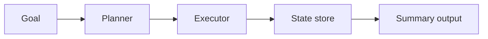

# agentic-workflow-engine

Task orchestration prototype for planner-driven execution, state tracking, and result aggregation.

## Why This Exists

To demonstrate agentic system design patterns with clear planner/executor boundaries.

## Architecture



## Project Layout

- `src/planner/` plan generation
- `src/executor/` task execution contract
- `src/state/` run-state tracking
- `src/engine/` orchestration + summarization
- `tests/` orchestration tests
- `docs/` architecture + ADRs

## Usage

```bash
python -m pytest -q
```

## Roadmap

- Add task retries and timeout policy
- Add pluggable executor backends
- Add persisted state adapter
